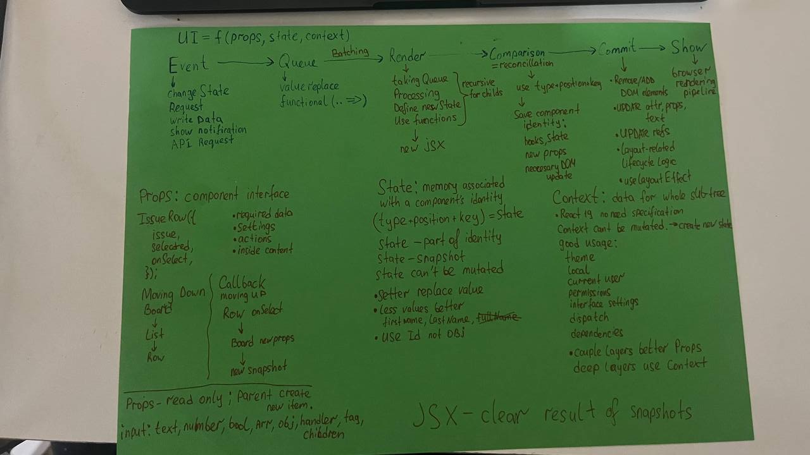

# Day 1 — render, commit, state, identity

Suggested time: 2.5–3 hours. Output: code, evidence, and a verbal explanation.

## Learning goals

By the end of the session, explain and demonstrate:

- what causes a render and how render differs from commit;
- why UI can be modeled as `UI = f(props, state, context)`;
- how state snapshots, batching, and functional updates work;
- how stale closures appear;
- how component identity preserves or resets state;
- why index keys can move state between rows;
- what Strict Mode reveals and what it does not guarantee.

## Starting evidence

The original sketch is preserved exactly as received. A rotated copy is used
below for easier reading.



- [Original unmodified image](assets/mental-model-sketch-original.jpg)
- [Transcription and review](notes-from-sketch.md)
- [Polished mental model](mental-model.md)
- [Documentation and videos](resources.md)

## Practical task: issue triage board

Build the board from scratch. It should eventually support adding, editing,
filtering, selecting, and intentionally resetting issues or an editor.

Suggested ownership:

```text
IssueBoard
├── issues
├── filter
├── selectedId
├── AddIssueForm
├── FilterBar
├── IssueList
│   └── IssueRow
└── IssueEditor
```

Keep derived values out of state when possible:

```jsx
const visibleIssues = issues.filter((issue) =>
  filter === 'all' ? true : issue.status === filter,
)
```

## Required bug experiments

### 1. Stale closure

Schedule an issue update from an old render snapshot. Reproduce a lost update,
then write the root cause before fixing it.

> The delayed callback was created during render ____. It captured ____. Before
> it ran, ____. It later calculated the next state from ____, causing ____.

### 2. Incorrect key

Use an array index as the key while a row owns local draft state. Edit one row,
then filter, delete, insert, or reorder earlier rows. Record which draft moves
before replacing the key with `issue.id`.

> The key represented ____, not the issue's identity. After ____, React matched
> the previous row identity to ____, so the local state ____.

## Verbal interview checker

Answer without reading notes:

1. What exactly happens after a state setter is called?
2. Why can two visually identical components hold different state?
3. When is an index key unsafe? Give a concrete failure sequence.
4. What does Strict Mode help reveal, and what does it not guarantee?

## Completion evidence

- [ ] The application starts locally.
- [ ] Add, edit, filter, select, and reset work.
- [ ] Both intentional bugs have before/after reproduction notes.
- [ ] Stable IDs are used as list keys in the fixed version.
- [ ] An intentional reset is demonstrated with a changed key.
- [ ] Strict Mode observations are written down.
- [ ] All four verbal answers can be given without reading.
- [ ] `npm run lint` and `npm run build` pass.
